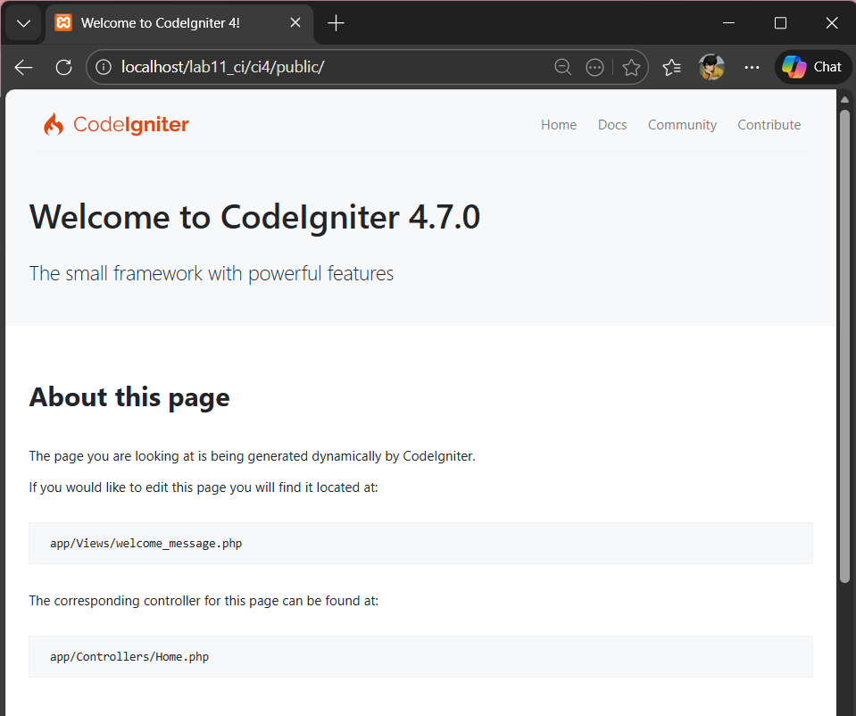
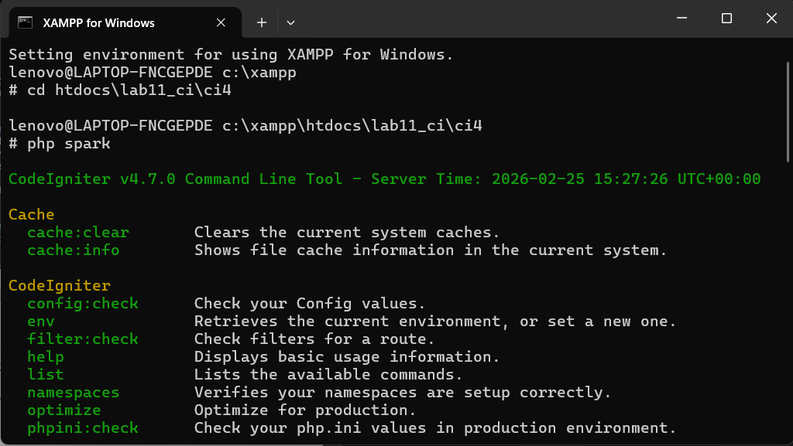
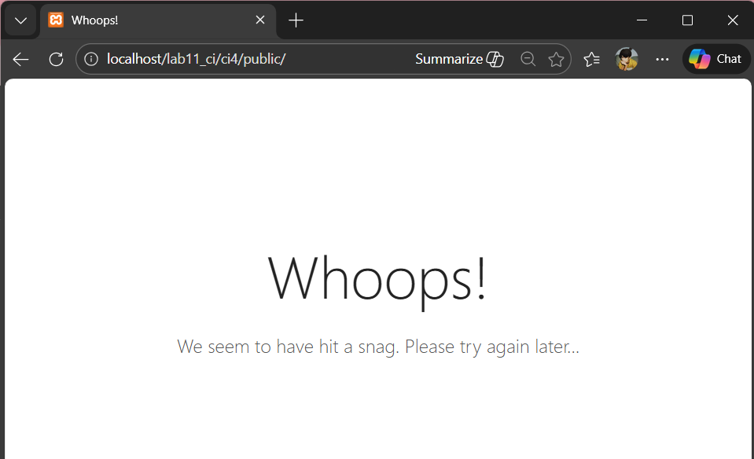
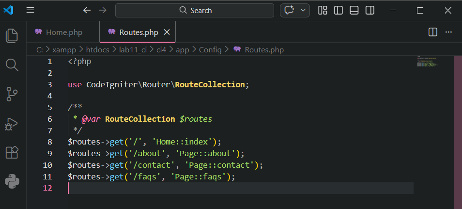
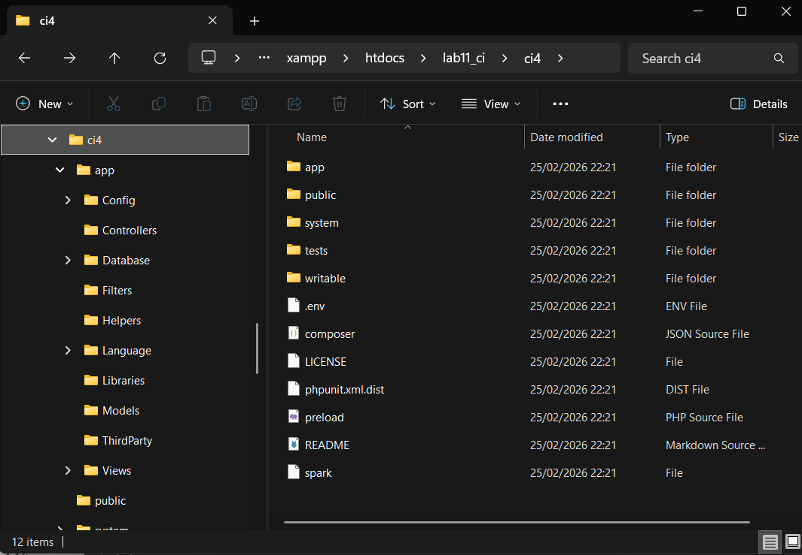
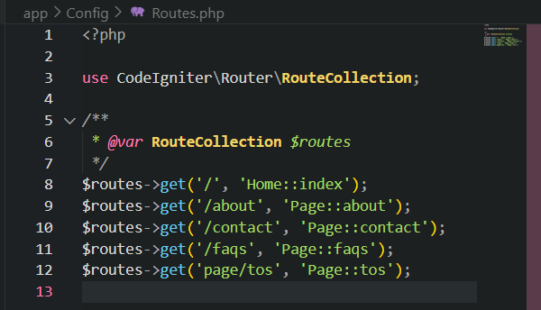
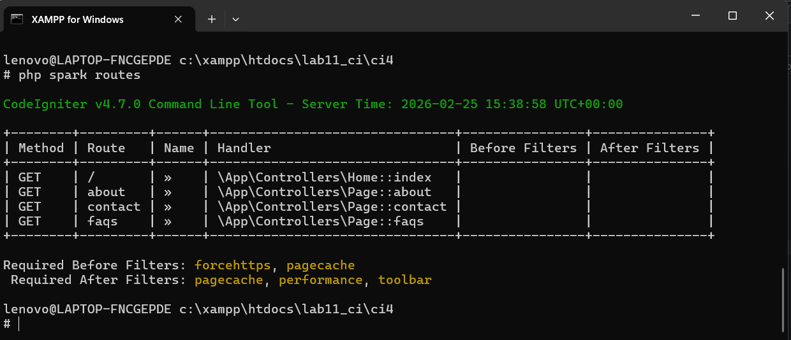
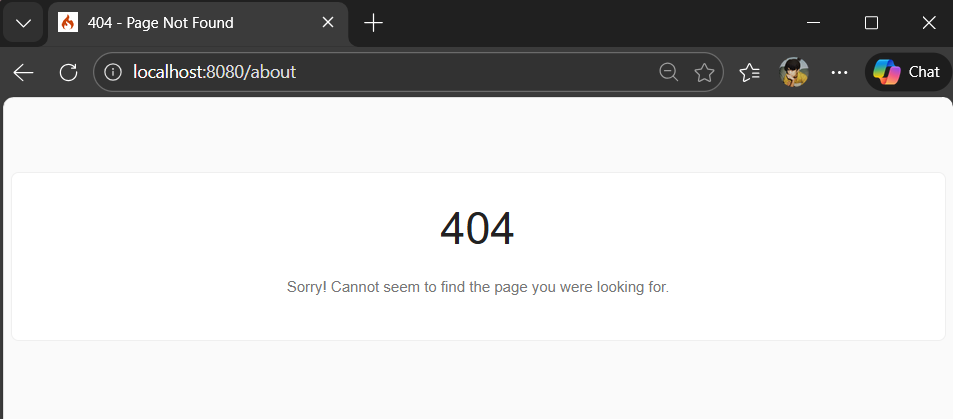
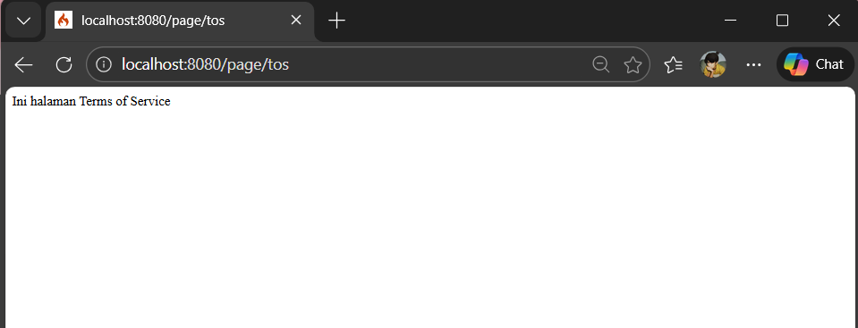
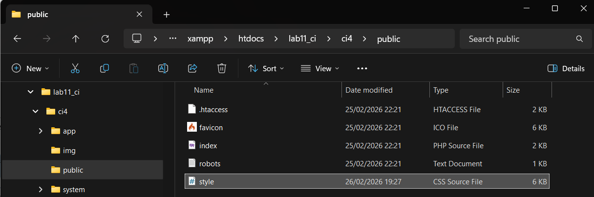

# Praktikum 1: PHP Framework (Codeigniter)

## Tujuan
1. mahasiswa mampu memahami konsep dasar Framework.
2. Mahasiswa mampu memahami konsep darae MVC.
3. Mahasiswa mampu membuat program sederhana menggunakan Framework Codeigniter4.

## Langkah - langkah Prakyikum
### 1. Persiapan Server Requirements
Sebelum memulai, pastikan perangkat lunak pendukung sudah sesuai dengan standar minimum agar farmework dapat berjalan:
1. Versi PHP: Gunakan versi 8.2 atau yang lebih baru.
2. Ekstensi PHP: Pastikan ekstensi intl, mbstring, json, mysqlnd (untuk database), dan libcurl sudah aktif di konfigurasi PHP anda.


### Instalasi Condeigniter4
Untuk melakukan instalasi  Codeigniter 4 kita akan menggunakan cara manual dengan mengunduh dari website https://codeigniter.com/download  
• Extrak file zip Codeigniter ke direktori htdocs/lab11_ci.
• Ubah nama direktory framework-4.x.xx menjadi ci4. 
•Buka browser dengan alamat http://localhost/lab11_ci/ci4/public/  



### Menjalankan CLI (Command Line Interface)
Untuk mengakses CLI buka terminal/command prompr. Arahkan lokasi direktori sesuai dengan direktori kerja project dibuat (xampp/htdocs/lab11_ci/ci4).
Perintah yang dapat dijalankan untuk memanggil CLI Codeigniter adalah:
```
php spark
```



### Mengaktifkan Mode Debugging
Codeigniter 4 menyediakan fitur debugging untuk memudahkan developer untuk mengetahui pesan error apabila terjadi kesalahan dalam membuat kode program. 
Secara default fitur ini belum aktif. Ketika terjadi error pada aplikasi akan ditampilkan pesan kesalahan seperti berikut. 



Ubah nama file env menjadi .env kemudian buka file tersebut dan ubah nilai variable CI_ENVIRINMENT menjadi development. 


Contoh error yang terjadi. Untuk mencoba error tersebut, ubah kode pada file app/Controller/Home.php hilangkan titik koma pada akhir kode. 



### Struktur Direktori
Fokus kita pada folder app, dimana folder tersebut adalah area kerja kita untuk membuat aplikasi. Dan folder public untuk menyimpan aset web seperti css, gambar, javascript, dll. 



### Routiing dan Controller
Router terletak pada file app/config/Routes.php 
```php
$routes->get('/', 'Home::index'); 
```
#### Membuat Route Baru
```php
$routes->get('/about', 'Page::about'); 
$routes->get('/contact', 'Page::contact'); 
$routes->get('/faqs', 'Page::faqs'); 
```



Untuk mengetahui route yang ditambahkan sudah benar, buka CLI dan jalankan perintah barikut
```
php spark routes 
```


Selanjutnya coba akses route yang telah dibuat dengan mengakses alamat url http://localhost:8080/about 



Ketika diakses akan mucul tampilan error 404 file not found, itu artinya file/page tersebut tidak ada. Untuk dapat mengakses halaman tersebut, harus dibuat terlebih dahulu Contoller yang sesuai dengan routing yang dibuat yaitu Contoller Page. 

#### Membuat Controller
```php
<?php 

namespace App\Controllers; 

class Page extends BaseController 
{ 
    public function about() 
    { 
        echo "Ini halaman About";
    } 

    public function contact() 
    { 
        echo "Ini halaman Contact"; 
    }
    
    public function faqs() 
    { 
        echo "Ini halaman FAQ"; 
    } 

    public function tos()
    { 
        echo "Ini halaman Terms of Service"; 
    }
}
```
Refresh kembali halaman browser.


#### Auto Routing
Secara default fitur autoroute pada Codeiginiter sudah aktif. Untuk mengubah status autoroute dapat mengubah nilai variabelnya. Untuk menonaktifkan ubah nilai true menjadi false. 
```php
$routes->setAutoRoute(true); 
```
Tambahkan method baru pada Controller Page seperti berikut. 
```php
public function tos() 
{ 
    echo "ini halaman Term of Services"; 
} 
```
Method ini belum ada pada routing, sehingga cara mengaksesnya dengan menggunakan alamat: http://localhost:8080/page/tos  



### Membuat View
```html
<!DOCTYPE html> 
<html lang="en"> 
<head> 
    <meta charset="UTF-8"> 
    <title><?= $title; ?></title> 
</head> 
<body> 
    <h1><?= $title; ?></h1> 
    <hr> 
    <p><?= $content; ?></p> 
</body> 
</html> 
```
Ubah method about pada class Controller Page menjadi seperti berikut: 
```php
public function about() 
{ 
    return view('about', [ 
        'title' => 'Halaman Abot', 
        'content' => 'Ini adalah halaman abaut yang menjelaskan tentang isi halaman ini.' 
    ]); 
}
```
Setelah itu refresh halaman itu.


### Membuat Layout Web dengan CSS
uat file css pada direktori public dengan nama style.css (copy file dari praktikum lab4_layout). Kita akan gunakan layout yang pernah dibuat pada praktikum 4. 
```css
/* import google font */
@import
url('https://fonts.googleapis.com/css2?family=Open+Sans:ital,wght@0,300;0,400;0,600;0,700;0,800;1,300;1,400;1,600;1,700;1,800&display=swap');
@import
url('https://fonts.googleapis.com/css2?family=Open+Sans+Condensed:ital,wght@0,300;0,700;1,300&display=swap');
/* Reset CSS */
* {
    margin: 0;
    padding: 0;
}

body {
    line-height:1;
    font-size:100%;
    font-family:'Open Sans', sans-serif;
    color:#5a5a5a;
}

#container {
    width: 980px;
    margin: 0 auto;
    box-shadow: 0 0 1em #cccccc;
}

/* header */
    header {
    padding: 20px;
}
header h1 {
    margin: 20px 10px;
    color: #b5b5b5;
}

/* navigasi */
nav {
    display: block;
    background-color: #1f5faa;
}

nav a{
    padding: 15px 30px;
    display: inline-block;
    color: #ffffff;
    font-size: 14px;
    text-decoration: none;
    font-weight: bold;
}

nav a.active,
nav a:hover {
    background-color: #2b83ea;
}

/* Hero Panel */
#hero {
    background-color: #e4e4e5;
    padding: 50px 20px;
    margin-bottom: 20px;
}

#hero h1 {
    margin-bottom: 20px;
    font-size: 35px;
}

#hero p {
    margin-bottom: 20px;
    font-size: 18px;
    line-height: 25px;
}

#main {
    float: left;
    width: 640px;
    padding: 20px;
}

/* sidebar area */
#sidebar {
    float: left;
    width: 260px;
    padding: 20px;
}

/* widget */
.widget-box {
    border:1px solid #eee;
    margin-bottom:20px;
 }
.widget-box .title {
    padding:10px 16px;
    background-color:#428bca;
    color:#fff;
}
    .widget-box ul {
    list-style-type:none;
}
    .widget-box li {
    border-bottom:1px solid #eee;
}
.widget-box li a {
    padding:10px 16px;
    color:#333;
    display:block;
    text-decoration:none;
}
.widget-box li:hover a {
    background-color:#eee;
}
.widget-box p {
    padding:15px;
    line-height:25px;
}

/* footer */
footer {
    clear: both;
    background-color: #1d1d1d;
    padding: 20px;
    color: #eee;
}

/* box */
.box {
    display:block;
    float:left;
    width:33.333333%;
    box-sizing:border-box;
    -moz-box-sizing:border-box;
    -webkit-box-sizing:border-box;
    padding:0 10px;
    text-align:center;
}
.box h3 {
    margin: 15px 0;
}
.box p {
    line-height: 20px;
    font-size: 14px;
    margin-bottom: 15px;
}
box img {
    border: 0;
    vertical-align: middle;
}
.image-circle {
    border-radius: 50%;
}
.row {
    margin: 0 -10px;
    box-sizing: border-box;
    -moz-box-sizing: border-box;
    -webkit-box-sizing: border-box;
}
.row:after, .row:before,
.entry:after, .entry:before {
    content:'';
    display:table;
}
.row:after,
.entry:after {
    clear:both;
}

.divider {
    border:0;
    border-top:1px solid #eeeeee;
    margin:40px 0;
    }
/* entry */
.entry {
    margin: 15px 0;
}
    .entry h2 {
    margin-bottom: 20px;
}
.entry p {
    line-height: 25px;
}
.entry img {
    float: left;
    border-radius: 5px;
    margin-right: 15px;
}
.entry .right-img {
    float: right;
}

/* Bagian About */
.about-section {
    padding: 40px 20px;
}

.about-section h2 {
    color: #1f5faa;
    margin-bottom: 15px;
}

.about-section p {
    font-size: 18px;
    color: #555;
    line-height: 1.6;
    margin-bottom: 30px;
    max-width: 800px;
}

.portfolio {
    display: flex;
    flex-wrap: wrap;
    justify-content: center;
    gap: 20px;
}

.portfolio-item {
    background-color: #f4f6fa;
    border: 1px solid #e0e0e0;
    border-radius: 8px;
    text-align: center;
    padding: 20px;
    width: 280px;
    transition: all 0.3s ease;
}

.portfolio-item:hover {
    transform: translateY(-5px);
    box-shadow: 0 4px 10px rgba(0,0,0,0.1);
}

.portfolio-item img {
    width: 100%;
    max-width: 220px;
    border-radius: 8px;
    margin-bottom: 10px;
}

.portfolio-item h4 {
    color: #1f5faa;
    margin-bottom: 8px;
    font-size: 18px;
}

.portfolio-item p {
    font-size: 18px;
    color: #666;
    line-height: 1.5;
}

/* Bagian Kontak */
.contact-section {
    padding: 40px 20px;
}

.contact-section h2 {
    color: #1f5faa;
    margin-bottom: 10px;
}

.contact-section p {
    color: #555;
    margin-bottom: 25px;
    font-size: 16px;
}

.contact-form {
    max-width: 500px;
    margin: 0 auto;
    background-color: #f4f6fa;
    border: 1px solid #e0e0e0;
    border-radius: 8px;
    padding: 25px 30px;
}

.contact-form label {
    display: block;
    font-weight: bold;
    color: #333;
    margin-bottom: 5px;
}

.contact-form input,
.contact-form textarea {
    width: 100%;
    padding: 10px;
    border: 1px solid #ccc;
    border-radius: 5px;
    margin-bottom: 15px;
    font-size: 14px;
}

.contact-form textarea {
    resize: vertical;
}

.contact-form button {
    background-color: #1f5faa;
    color: #fff;
    border: none;
    padding: 10px 18px;
    border-radius: 5px;
    cursor: pointer;
    font-size: 15px;
    transition: 0.3s;
}

.contact-form button:hover {
    background-color: #2b83ea;
}

/* Responsif */
@media (max-width: 768px) {
    .portfolio {
        flex-direction: column;
        align-items: center;
    }

    .portfolio-item {
        width: 90%;
    }

    .contact-form {
        width: 90%;
        padding: 20px;
    }
}
```



Kemudian buat folder template pada direktori view kemudian buat file header.php dan footer.php

File app/view/template/header.php
```html
<!DOCTYPE html> 
<html lang="en"> 
<head> 
    <meta charset="UTF-8"> 
    <title><?= $title; ?></title> 
    <link rel="stylesheet" href="<?= base_url('/style.css');?>"> 
</head> 
<body> 
    <div id="container"> 
    <header> 
        <h1>Layout Sederhana</h1> 
    </header> 
    <nav> 
        <a href="<?= base_url('/');?>" class="active">Home</a> 
        <a href="<?= base_url('/artikel');?>">Artikel</a> 
        <a href="<?= base_url('/about');?>">About</a> 
        <a href="<?= base_url('/contact');?>">Kontak</a> 
    </nav> 
    <section id="wrapper"> 
        <section id="main"> 
```
File app/view/template/footer.php
```php
        </section> 
        <aside id="sidebar"> 
            <div class="widget-box"> 
                <h3 class="title">Widget Header</h3> 
                <ul> 
                    <li><a href="#">Widget Link</a></li> 
                    <li><a href="#">Widget Link</a></li> 
                </ul> 
            </div> 
            <div class="widget-box"> 
                <h3 class="title">Widget Text</h3> 
                <p>Vestibulum lorem elit, iaculis in nisl volutpat, 
malesuada tincidunt arcu. Proin in leo fringilla, vestibulum mi porta, 
faucibus felis. Integer pharetra est nunc, nec pretium nunc pretium ac.</p> 
            </div> 
        </aside> 
    </section> 
    <footer> 
        <p>&copy; 2021 - Universitas Pelita Bangsa</p> 
    </footer> 
    </div> 
</body> 
</html> 
```
Kemudian ubah file app/view/about.php
```php
<?= $this->include('template/header'); ?> 
 
<h1><?= $title; ?></h1> 
<hr> 
<p><?= $content; ?></p> 
 
<?= $this->include('template/footer'); ?> 
```
Selanjutnya refresh tampilan pada alamat http://localhost:8080/about 

 
